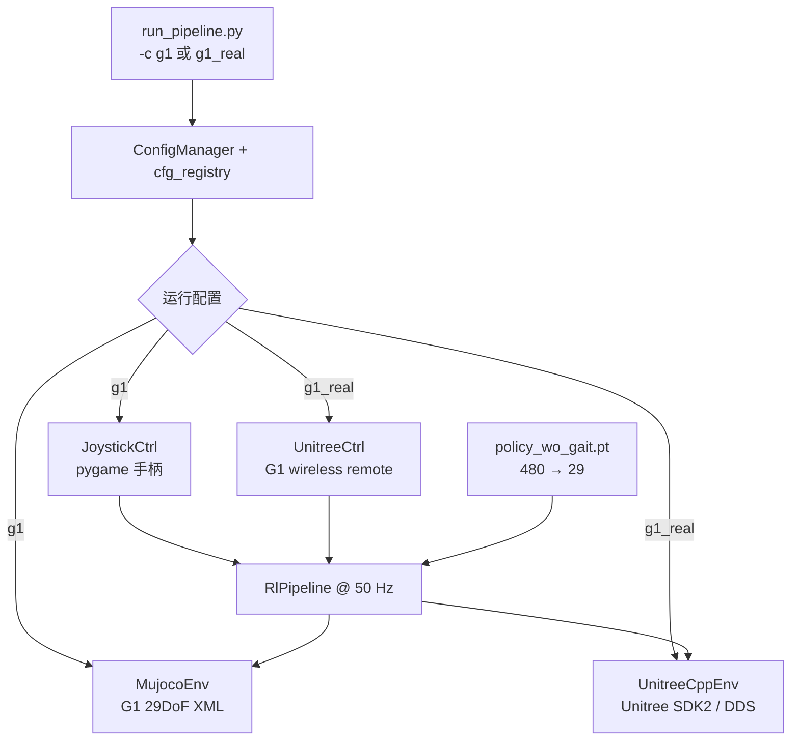
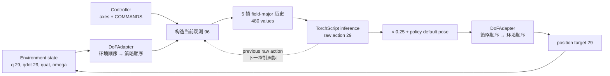
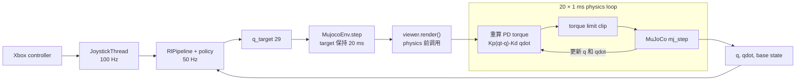
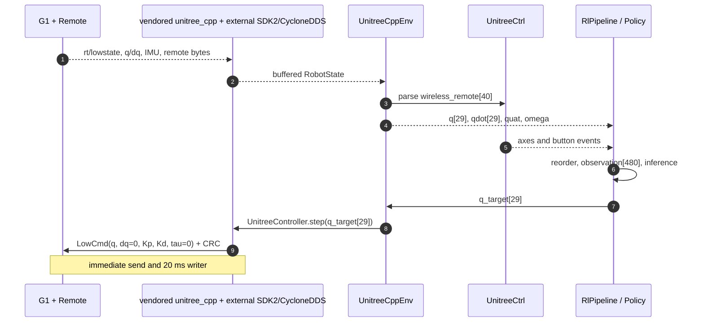
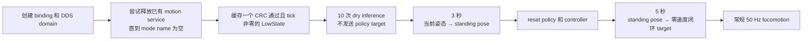

# RoboJuDo Sim2Sim / Sim2Real 部署架构

本文描述当前精简版本的实际运行路径。仓库只保留 **Unitree G1 29DoF**、一个
`UnitreeWoGaitPolicy` TorchScript 模型和一个 `RlPipeline`。`g1` 与 `g1_real` 共享策略及数据合同，仅替换输入控制器
和执行环境。

> RoboJuDo 是部署运行时，不包含 Isaac Lab、unitree_rl_lab 或其他源仿真器中的训练代码。这里的 sim2sim
> 是“外部训练导出的策略 → MuJoCo 验证”；sim2real 是“同一导出策略 → Unitree SDK2 实机执行”。

## 1. 配置驱动的组件装配

入口 [`scripts/run_pipeline.py`](../scripts/run_pipeline.py) 用 `ConfigManager` 从注册表解析 `-c` 参数，再按配置创建
环境、控制器和策略。当前公开组件集合由测试锁定，不存在隐藏的第二套部署路径。

配置注册是 eager 的：导入 `robojudo` 会加载 `config/g1/g1_cfg.py` 并注册 `g1`、`g1_real`。环境、控制器、
pipeline 和 policy 则通过 `Registry` lazy import；配置第一次请求某个类型时才加载对应模块。这种机制负责对象
装配，不会自动检查跨组件的频率、坐标系或硬件语义。

| 配置 | 输入 | 共享闭环 | 执行后端 | `prepare()` | 安全检查 |
| --- | --- | --- | --- | --- | --- |
| `g1` | `JoystickCtrl`，本地 Xbox 手柄 | `RlPipeline` + `UnitreeWoGaitPolicy` | `MujocoEnv` | 不调用 ramp/blend；构造时仍执行 10 次 dry inference | 默认关闭 |
| `g1_real` | `UnitreeCtrl`，G1 遥控器 | `RlPipeline` + `UnitreeWoGaitPolicy` | `UnitreeCppEnv` | 3 秒站姿 ramp + 5 秒策略 blend | 开启 |



配置类 `g1_real` 继承 `g1`，因此策略没有复制或分叉；它只覆盖环境、控制器和 `do_safety_check=True`。当前
实机网卡在 [`g1_cfg.py`](../robojudo/config/g1/g1_cfg.py) 中配置为 `enP8p1s0`，部署前必须按目标机器核对，名称
区分大小写。

## 2. 共享的名义 50 Hz 闭环

每个控制周期都执行相同的状态、推理和目标生成流程：



环境顺序和策略顺序并不相同，但两者必须是同一个、无重复的完整 29 关节集合。`DoFAdapter` 只负责重排；
缺少关节、额外关节或局部控制会直接报错。策略中的站姿、Kp、Kd 会按关节名重排并覆盖环境值，环境自身的
torque/position limits 则保留。

实机还有第三层 **SDK motor order**。当前 `joint2motor_idx=None`，即假定 SDK state/command 顺序与 environment
顺序一致。即使配置非空映射，现有实现也只按该映射读取 `q/dq`，发送 target 时没有执行逆映射；因此当前架构
并不支持任意硬件 motor order。改变电机顺序必须同时实现读写双向映射并在脱机条件下验证。

单帧观测是 96 维：

| 字段 | 维度 | 处理 |
| --- | ---: | --- |
| base angular velocity | 3 | 乘 `0.2` |
| projected gravity | 3 | 由 `[x,y,z,w]` 四元数计算 |
| velocity command | 3 | 手柄轴映射到最大 `0.8 m/s`、`0.5 m/s`、`1.57 rad/s` |
| joint position error | 29 | `q - policy_default_pose` |
| joint velocity | 29 | 乘 `0.05` |
| previous raw action | 29 | 上一帧未乘 action scale 的网络输出 |

五帧历史不是五个连续的 96 维 frame，而是 **field-major** 排列：

```text
ang_vel[5帧] | gravity[5帧] | command[5帧] |
q_error[5帧] | q_vel[5帧] | previous_action[5帧]
```

模型得到 480 维输入并输出 29 维 raw action。当前 `action_beta=1`、`action_clip=None`，因此没有动作平滑或
网络输出限幅；最终位置目标为 `policy_default_pose + 0.25 × raw_action`。

50 Hz 是 policy 配置、MuJoCo simulated control interval 和 Unitree `control_dt` 的共同目标。外层循环只在计算
提前完成时补 sleep；如果推理、渲染或 I/O 超过 20 ms，并不能保证 wall-clock 仍达到 50 Hz。

当前 checkpoint 的 SHA-256 为
`b5861e91bba86cdb35dc10de9764e26336042c817e179ddcebc3427828677414`。现有自动测试锁定输入/输出 shape，
但没有锁定该 hash，也无法证明模型语义或行为安全。

## 3. Sim2Sim：外部训练策略到 MuJoCo



`MujocoEnv` 加载 `assets/robots/g1/g1_29dof_rev_1_0.xml`。策略周期为 20 ms；环境在每个策略周期内执行
20 个 1 ms 物理子步，因此物理频率为 1 kHz。每个子步计算 PD torque，并按环境 torque limits 裁剪后写入
MuJoCo actuator；`q_target` 在这 20 个子步内保持不变。每个控制周期会在物理子步前调用一次 viewer 的
`render()`，实际 framebuffer 更新节奏还受 VSync 和 viewer 内部调度影响。命令 marker 在 physics 后根据该周期
开始时捕获的 state 更新，因此会在下一次 render 时显示。

sim2sim 能否成立，取决于以下训练/部署合同是否一致，而不是仅看模型能否加载：29 关节名称、策略顺序、
默认站姿、Kp/Kd、观测缩放、field-major 历史布局、action scale、50 Hz 控制周期和命令方向。仓库测试会检查
关节集合、XML 闭包及 `480 → 29` shape，但行为一致性仍需人工完成站立、零命令、三个速度方向、跌倒和停机验证。

`g1` 不执行实机的 ramp/blend，且 tilt safety 默认关闭。`sim_duration=60` 当前没有接入退出条件；关闭 viewer
窗口也不会自动把 `pipeline.running` 置为 false。构造 pipeline 时仍会读 state/controller、构造观测并执行
10 次 dry inference，但不调用 `env.step()`；之后 policy history 会再次 reset。能保证 Python graceful shutdown
路径的是手柄 `A` 或 `Ctrl+C`，强制终止进程不应被视为正常停机。

## 4. Sim2Real：同一策略到 G1



`g1_real` 显式选择 `hardware / domain 0 / 配置的真实网卡`；endpoint 组合会在构造 C++ controller 前复验，
vendored `unitree_cpp` 随后订阅 HG `rt/lowstate`、发布 `rt/lowcmd`。进程内 ChannelFactory guard 允许复用相同
endpoint，但拒绝切换到不同 domain/interface。LowState callback 校验 CRC，
提取 29 个 motor state、IMU 和 40 字节遥控器数据；`UnitreeCppEnv` 把 IMU 四元数从 `[w,x,y,z]` 转为共享的
`[x,y,z,w]`。遥控器字节由 `UnitreeCtrl` 解析，轴合同与仿真一致：`LeftY` 前后、`LeftX` 横移、`RightX`
转向，`A` 产生 `[SHUTDOWN]`。本地路径信任 SDL/pygame 提供预期范围内的轴值，只执行反向和 round；Unitree
路径同样直接信任 wireless remote 协议的浮点值。两条路径都没有统一的额外 clamp。配置中的
`msg_type="hg"` 也不是动态 wire-type 开关：当前 vendored C++ 直接编译 HG LowCmd/LowState 类型。

当前配置为 `hand_type="NONE"`，RoboJuDo 不发送手部目标。vendored binding 仍会创建 Dex-3 left/right command
publisher 和 hand writer thread，但 hand buffer 为空，因此该残留路径不会实际发布 hand command。

首次进入主循环前，实机依次经历：



ramp 和 blend 阶段会把速度轴强制置零，但仍处理 `A` 和倾倒检查。C++ `step()` 把位置目标与 Kp/Kd 放入
command buffer，并立即发布一次；后台 20 ms writer 继续发布最近一次 command。

## 5. 安全机制与真实边界

| 机制 | 当前行为 | 不能保证的内容 |
| --- | --- | --- |
| startup self-check | 每次寻找缓存中 CRC 通过且 tick 非零的 LowState，最多约 3 秒；启动链调用两次且可复用同一缓存 | 不要求 tick 递增，不验证机器人型号、映射、故障码、状态新鲜度或安全姿态 |
| LowState CRC | CRC 错误时丢弃该消息 | 旧 state buffer 仍保留；没有运行期 freshness watchdog |
| tilt check | `g1_real` 倾角超过 `1.0 rad` 后请求 shutdown | 检查发生在常规帧 target 发出之后，不是硬实时保护 |
| frame timing | 实机掉帧超过 200 ms 时退出主循环 | 不能替代 DDS command timeout 或硬件保护 |
| remote `A` | 停止后续 Python target；发送 `Kp=0, Kd=5` 的阻尼命令 | 不是断使能，也不是认证急停；常规闭环的触发帧仍先发送一次策略 target |

当前实机路径不会用 `position_limits` 限制 `q_target`，也完全不使用 `torque_limits`；只有 MuJoCo 会裁剪其
PD 计算出的 torque。系统也没有 LowState freshness/tick watchdog、遥控器 deadman 或应用层 command timeout。
初始化脚本中的 pipeline 构造和 `prepare()` 都位于主 `try/finally` 之前，因此这些阶段的异常不应被假定为
一定执行软件 shutdown。vendored binding 在 LowCmd/LowState publisher/subscriber 建立前还会循环尝试释放已有
motion service，当前没有重试上限。

这些限制意味着：软件检查只能帮助发现部分错误，独立硬件急停、支撑装置、隔离区、双人操作和先 sim2sim
验证仍是 sim2real 的必要条件。

自动测试同样不是运行验证：它不会创建 GLFW/MuJoCo 窗口，不会跑完整 50 Hz loop、prepare 或 safety 时序，
也不会连接 DDS；没有构建 UnitreeCpp 时，硬件环境 import 测试会被跳过。

## 6. 修改影响地图

| 要修改的合同 | 主要位置 | 必须同步验证 |
| --- | --- | --- |
| checkpoint / observation / action | `policy/`, `config/g1/policy/`, `assets/models/` | 480→29 shape、field-major 顺序、MuJoCo 行为 |
| joint order / pose / gains | `config/g1/env/`, `config/g1/policy/`, `tools/dof.py` | 完整 29-name 集合、双向重排、站姿和 PD |
| control rate | `PolicyCfg.freq`, MuJoCo dt/decimation, Unitree `control_dt` | 三处保持 20 ms，实机无持续掉帧 |
| command axes / shutdown | `controller/`, `policy/unitree_policy.py` | 三轴方向、零命令、`A` 软件停机 |
| DDS topics / NIC | `environment/env_cfgs.py`, `config/g1/g1_cfg.py`, vendored binding | SDK2 收发、自检、独立硬件急停 |

建议阅读顺序：本文 → [Policy contract](policy.md) → [Controller mappings](controller.md) →
[Environment contract](environment.md) → [Real-robot setup and safety](unitree_setup.md)。
